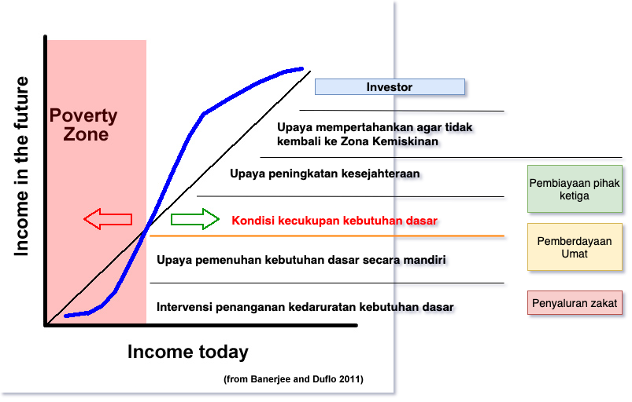

# Pendahuluan {#intro}

## Studi kasus di bidang Ekologi

Sebut saja namanya Asep. Namanya bukan singkatan dari Anak Saha Eta Pak ya. Ia adalah mahasiswa tingkat akhir Biologi Unpad. Hobinya mengamati burung di alam dan topik penelitian tugas akhirnya adalah keanekaan dan distribusi burung di Kota Bandung. Salah satu hasil dari studi literatur yang ia peroleh adalah, adanya penurunan keanekaan burung di beberapa taman Kota Bandung, seperti tersaji dalam tabel berikut :

```{r table2 , echo=FALSE, results='asis'}
  cat(' Table: \\label{tab:table2} __Keanekaan Burung di Kota Bandung__

   __Lokasi__            | __1990__ | __2000__| __2010__ |
  ------------------:|-----:|----:|-----:|
     Taman Ganesha     |   3.10|  3.01| 2.78  |
   Taman Balaikota     |   2.62|  2.43| 2.11  |
   Taman Maluku        |   2.83|  2.67| 2.43  | 
   Taman Tegalleaga    |   1.90|  1.75| 1.63  |')

```


Berdasarkan tabel tersebut, dalam draft proposal yang sedang disusun, ia akan mengajukan hipotesis bahwa penurunan keanekaan dan distribusi burung di Kota Bandung dipengaruhi oleh perubahan tutupan lahan. 

Ada empat hal yang menjadi pertanyaan. Yang pertama adalah hipotesis tersebut walaupun benar, semua orang mafhum bahwa Bandung yang sekarang tidak sama dengan Bandung tiga puluh tahun yang lalu, namun hipotesisnya tidak ilmiah, tidak berdasarkan data. Salah satu cara untuk mendapatkan data tutupan lahan adalah menggunakan penginderaan jauh (inderaja), yang ia sendiri tidak tahu bagaimana caranya.

Pertanyaan kedua yang ia hadapi adalah bagaimana caranya menghubungkan data lapangan dengan data tutupan lahan dari citra satelit. 

Yang ketiga, bagaimana ia dapat membuktikan bahwa perubahan tata guna lahan berpengaruh terhadap penurunan keanekaan dan distribusi sebaran burung di Kota Bandung.

Yang keempat adalah bagaimana ia dapat menyajikan atau memvisualisasikan hasil penelitiannya dalam bentuk tabel, gambar dan peta?

## Studi kasus di pemberdayaan masyarakat

Hampir dua tahun yang lalu, saya berbincang dengan Mas Rayan dari LAZ Al-Azhar. Kala itu ia menjabat sebagai "Kepala Sekolah" di Rumah Gemilang Indonesia (RGI). Sekarang, ia diberi amanah sebagai General Manager Wakaf Al-Azhar dan BMT Al-Azhar, sebuah posisi yang terkait dengan studi kasus kali ini.

Saat diskusi, ia menyodorkan sebuah konsep yang dimodifikasi dari Banerjee dan Duflo, 2011. 

```{r case001, fig.cap='Konsep dasar pemberdayaan umat',echo=FALSE, message=FALSE, warning=FALSE, out.width='90%', fig.asp=.85, fig.align='center'}

```

Dari gambar tersebut, apa yang selama ini dilakukan oleh Baznas dan lembaga amil zakat lainnya, sudah menyentuh semua tingkatan, mulai dari penyaluran zakat hingga ke pembiayaan pihak ketiga. Contoh dari pembiayaan pihak ketiga adalah pembiayaan modal berbasis syariah.

Yang menarik adalah ketika kita berbicara tentang tingkat keberhasilan. Selama ini, penyaluran Zakat/Sedekah/Infak (ZIS) dianggap berhasil apabila amanah sudah disampaikan kepada mustahik (yang berhak). Selesai. Padahal, yang diharapkan adalah mustahik memiliki kesadaran dan kemampuan untuk keluar dari zona kemiskinan. Artinya, mereka sadar bahwa saat ini sifat bantuan adalah darurat. Namun yang terjadi adalah sebagian dari mereka tetap berharap pada bantuan itu di waktu berikutnya.

Oleh karena itu, RGI merupakan salah satu solusi yang dikembangkan oleh Al-Azhar untuk membentuk kader-kader pemberdayaan umat. Santri-santri RGI dipilih dari keluarga tidak mampu, diseleksi berdasarkan banyak faktor. Salah satu faktor pentingnya adalah niat dan semangat mereka untuk menjadi katalisator untuk pemberdayaan umat. Diharapkan mereka mampu membawa diri mereka, keluarga serta lingkungan sekitarnya untuk menjadi mandiri. Salah satu contoh alumninya yang berhasil adalah Marino Nugroho (https://www.youtube.com/watch?v=eIn-NgunP2Q)

Nah, salah satu kendala dalam pelaksanaan misi lembaga amil zakat adalah belum adanya sistem informasi yang terintegrasi. Sebagai contoh, sering didapati oknum yang memanfaatkan kesempatan. Mereka mengaku sebagai mustahik dan meminta bantuan kepada satu LAZ, setelah itu meminta lagi ke LAZ lainnya dan seterusnya. Solusi saat ini yang dilakukan adalah komunikasi antar lembaga dalam satu grup Whatsapp. Apabila informasi mustahik dikumpulkan dalam satu basis data terintegrasi, berbasis Nomor Induk Kependudukan (NIK), akan mudah bagi LAZ untuk mengecek status calon mustahik.

Masalah lainnya adalah belum ada yang menerapkan SIG sebagai alat bantu dalam pengelolaan data dan informasi. SIG dapat digunakan mulai dari pencarian calon mustahik, status distribusi bantuan, monitoring tingkat kemandirian mustahik dan banyak lagi (_you name it lah_).

Dalam studi kasus ini, kita akan ekplorasi satu demi satu, misalnya seperti berikut :

1. Pembuatan desain basis data geospasial
2. Melakukan digitasi lokasi calon mustahik.
3. Melakukan survey menggunakan aplikasi QField dan/atau Input
4. Menampilkan data dan informasi dengan WebGIS berbasis QGIS Server dan Lizmap.


