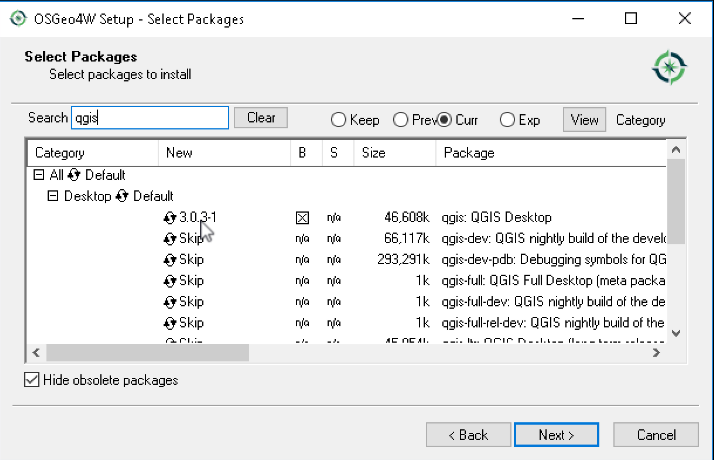

# Persiapan {#persiapan}

## Perangkat lunak


### Instalasi

QGIS berjalan pada Windows, berbagai distribusi Linux, Unix, Mac OS X, dan Android. Proyek QGIS menyediakan paket siap pakai serta instruksi untuk membangun dari kode sumber di https://qgis.org/en/site/forusers/download.html .

Pada bagian ini, kami akan menjelaskan tentang cara menginstal QGIS pada Windows, Ubuntu dan Mac OS X, serta bagaimana cara menghindari kesalahan yang paling umum.


```{block}
    Instruksi pemasangan lebih lanjut untuk sistem operasi lain   yang didukung 
    tersedia di http://www.qgis.org/en/site/forusers/alldownloads.html .
```

Salah satu hal bagus dari proyek open source adalah kita memiliki pilihan di antara rilis yang berbeda. Itu sama dengan QGIS. Opsi-opsi berikut tersedia, kita dapat memilih satu atau dapat memilih semua versi.

- Rilis terbaru (LR) : Ini adalah versi yang mencakup fitur yang baru dikembangkan dan diuji. Saat ini dirilis setiap empat bulan (kecuali ketika versi LTR dirilis sebagai gantinya). Jika kita ingin tetap mengikuti perkembangan terbaru tetapi tidak nyaman menggunakan versi pengembangan, kita dapat menggunakan versi ini.

- Rilis jangka panjang (LTR) : Versi LTR direkomendasikan untuk penggunaan perusahaan dan akademis. Saat ini dirilis sekali per tahun pada akhir Februari. Ia menerima pembaruan perbaikan bug selama setidaknya satu tahun, dan fitur dan antarmuka pengguna tetap tidak berubah. Ini menjadikannya pilihan terbaik untuk materi pelatihan yang tidak boleh usang setelah beberapa bulan.

- Versi pengembang (DEV, master, atau pengujian): Versi DEV yang mutakhir berisi perkembangan terbaru dan terhebat, tetapi berhati-hatilah bahwa dalam beberapa hari, versi ini mungkin tidak akan berfungsi dengan andal seperti yang kita inginkan.

#### Instalasi di MS Windows

Di Windows, ada dua opsi berbeda untuk menginstal QGIS , _standalone installer_ dan _OSGeo4W installer_ :

- _Standalone installer_ adalah satu file besar untuk diunduh (sekitar 280 MB); file berisi rilis QGIS, Geographic Analyss Support System (GRASS), serta System for Automated Geoscientific Analyses (SAGA) dalam satu paket. Proses instalasi untuk file ini mudah, seperti instalasi program MS Windows pada umumnya.

- _OSGeo4W installer_ adalah alat instalasi kecil, fleksibel yang memungkinkan untuk mengunduh dan menginstal QGIS serta banyak lagi _tool_ OSGeo dengan semua dependensi mereka. Keuntungan utama dari penginstal ini dari _standalon installer_ adalah kemudahan dalam melakukan pembaruan (_update_) QGIS dan dependensinya. kita selalu dapat memiliki akses ke versi rilis saat ini dan versi pengembang jika kita mau, tetapi tentu saja, kita tidak pernah dipaksa untuk memperbarui. 

Kita dapat mengunduh installer OSGeo4W 32-bit dan 64-bit dari http://osgeo4w.osgeo.org (atau langsung dari http://download.osgeo.org/osgeo4w/osgeo4w-setup-x86.exe untuk 32- versi bit atau http://download.osgeo.org/osgeo4w/osgeo4w-setup-x86_64.exe untuk versi Windows 64-bit). Unduh versi yang cocok dengan sistem operasi yang kita miliki dan simpan! Nanti, setiap kali kita ingin mengubah atau memperbarui sistem, jalankan saja lagi.

Ketika pemasang OSGeo4W dimulai, kita dapat memilih antara Express Desktop Install , Express Web-GIS Install , dan Advanced Install .

Untuk menginstal versi QGIS LR , kita cukup memilih opsi Instal Desktop Express , dan dialog berikutnya akan mendaftar aplikasi desktop yang tersedia, seperti QGIS, uDig, dan GRASS GIS. Kita cukup memilih QGIS, klik __Next__ , dan konfirmasikan dependensi yang diperlukan dengan mengklik __Next__ lagi. Kemudian unduhan dan instalasi akan dimulai secara otomatis. Ketika instalasi selesai, akan ada pintasan desktop dan entri menu mulai untuk OSGeo4W dan QGIS .

Untuk menginstal QGIS LTR (atau DEV), kita harus melalui opsi Instalasi Lanjutan, seperti yang ditunjukkan pada Gambar \@ref(fig:fig01).

```{r fig01, fig.cap='Advanced Install',echo=FALSE, message=FALSE, warning=FALSE, out.width='70%', fig.asp=.75, fig.align='center'}
knitr::include_graphics("img/fig01.png")
```


Jalur instalasi ini menawarkan banyak opsi, seperti __Download Without Installing__ dan __Install from Local Directory__ , yang dapat digunakan untuk mengunduh semua paket yang diperlukan pada satu mesin dan kemudian menginstalnya pada mesin tanpa akses Internet. Kita hanya memilih __Install from Internet__ , seperti yang ditunjukkan pada Gambar \@ref(fig:fig02) .

```{r fig02, fig.cap='Install from Internet',echo=FALSE, message=FALSE, warning=FALSE, out.width='70%', fig.asp=.75, fig.align='center'}
knitr::include_graphics("img/fig02.png")
```


Saat memilih __Root Directory__, seperti yang ditunjukkan pada screenshot berikut, hindari karakter khusus seperti umlaut Jerman atau huruf dari huruf selain yang Latin default di jalur instalasi (seperti yang disebutkan sebelumnya), karena mereka dapat menyebabkan masalah di kemudian hari, untuk contoh, selama instalasi plugin, seperti yang ditunjukkan pada Gambar \@ref(fig:fig03).


```{r fig03, fig.cap='Pilih direktori root',echo=FALSE, message=FALSE, warning=FALSE, out.width='70%', fig.asp=.75, fig.align='center'}
knitr::include_graphics("img/fig03.png")
```


Kemudian kita tentukan folder (__Local Package Directory__) di mana proses setup akan menyimpan file instalasi serta menyesuaikan nama menu Start. Kita biarkan pengaturan default seperti terlihat pada Gambar \@ref(fig:fig04).

```{r fig04, fig.cap='Memilih direktori untuk local package',echo=FALSE, message=FALSE, warning=FALSE, out.width='70%', fig.asp=.75, fig.align='center'}
knitr::include_graphics("img/fig04.png")
```


Dalam pengaturan koneksi Internet, biasanya tidak perlu mengubah pengaturan default, tetapi jika mesin, misalnya, tersembunyi di belakang proxy, kita akan dapat menentukannya di sini.

```{r fig05, fig.cap='Memilih tipe koneksi internet',echo=FALSE, message=FALSE, warning=FALSE, out.width='70%', fig.asp=.75, fig.align='center'}

```

Kemudian kita dapat memilih situs unduhan. Pada saat penulisan buku ini, ada tiga server unduh yang tersedia, seperti terlihat pada Gambar \@ref(fig:fig06). Dalam tutorial ini, kita memilih http://download.osgeo.org .

```{r fig06, fig.cap='Memilih alamat download',echo=FALSE, message=FALSE, warning=FALSE, out.width='70%', fig.asp=.75, fig.align='center'}
knitr::include_graphics("img/fig06.png")
```


Setelah installer mengambil informasi paket terbaru dari server OSGeo, kita dapat memilih paket untuk instalasi. QGIS LTR terdaftar dalam kategori desktop sebagai qgis-ltr (dan versi DEV terdaftar sebagai qgis-dev). Untuk memilih versi LTR untuk instalasi, klik pada teks yang bertuliskan Lewati , dan itu akan mengubah dan menampilkan nomor versi, seperti yang ditunjukkan pada Gambar \@ref(fig:fig07).

```{r fig07, fig.cap='Memilih paket yang akan diinstal',echo=FALSE, message=FALSE, warning=FALSE, out.width='70%', fig.asp=.75, fig.align='center'}

```


Seperti yang Anda lihat pada tangkapan layar berikut, penginstal akan secara otomatis memilih semua dependensi yang diperlukan (seperti GDAL , SAGA , OTB , dan GRASS ), jadi tidak perlu khawatir tentang ini.

```{r fig08, fig.cap='Mencentang pilihan untuk dependensi',echo=FALSE, message=FALSE, warning=FALSE, out.width='70%', fig.asp=.75, fig.align='center'}
knitr::include_graphics("img/fig08.png")
```


Setelah mengeklik __Next__ , unduhan dan pemasangan dimulai secara otomatis, seperti pada versi Express . Kita mungkin memperhatikan paket-paket QGIS lain yang tersedia yang disebut qgis-ltr-dev dan qgis-rel-dev . Ini berisi perubahan terbaru (ke versi LTR dan LR , masing-masing), yang akan dirilis sebagai versi perbaikan bug sesuai dengan jadwal rilis. Ini membuat paket-paket ini pilihan yang baik jika kita mengalami masalah dengan rilis yang telah diperbaiki baru-baru ini tetapi rilis versi perbaikan bug belum keluar.


#### Instalasi di Ubuntu

Di Ubuntu , proyek QGIS menyediakan paket untuk versi LTR , LR , dan DEV . Pada saat penulisan buku ini, versi Ubuntu Bionic , Artful , Xenial , dan Trusty didukung, tetapi kita dapat menemukan informasi terbaru di http://www.qgis.org/en/site/forusers/alldownloads.html# debian-ubuntu . Perlu diketahui, bahwa kita hanya dapat menginstal satu versi pada satu waktu.

Pada bagian ini, proses untuk menginstal QGIS 3 ( LR ) di Ubuntu 18,04 Bionic Beaver akan dijelaskan. Kita dapat merujuk ke tautan sebelumnya untuk menginstal versi QGIS LTR atau DEV .

1. Pertama, Kita tambahkan repositori QGIS 3 pada file sources.list pada mesin Bionic Beaver Ubuntu 18.04.

Edit file /etc/apt/sources.list dengan perintah berikut:

```
    $ sudo nano /etc/apt/sources.list
```

2. Kita tambahkan repositori spesifik QGIS 3 Ubuntu 18.04. Nama kode Ubuntu Bionic Beaver adalah bionic.

Tambahkan baris berikut ke bagian atas atau bawah file /etc/apt/sources.list:

```
    deb https://qgis.org/debian bionic main
```

Gambar berikut menunjukkan tampilannya setelah baris apt QGIS 3 ditambahkan ke file /etc/apt/sources.list.

```{r fig4, fig.cap='Menambahkan repository di sources.list',echo=FALSE, message=FALSE, warning=FALSE, out.width='60%', fig.asp=.75, fig.align='center'}

```


Jika menggunakan nano cukup tekan Ctrl + o sekali untuk menyimpan baris apt QGIS 3 ke file /etc/apt/sources.list, dan simpan dengan menekan Enter .

3. Selanjutnya adalah mengimpor kunci GPG dari QGIS 3 dengan perintah berikut:

```
    $ wget -O - https://qgis.org/downloads/qgis-2017.gpg.key | gpg --import
```

GPG key harus ditambahkan ke mesin Ubuntu 18.04 Bionic Beaver.

GPG key dapat diverifikasi apakah telah diimpor dengan benar menggunakan perintah berikut:

```
    $ gpg --fingerprint CAEB3DC3BDF7FB45
```

```{r fig5, fig.cap='Verifikasi GPG key',echo=FALSE, message=FALSE, warning=FALSE, out.width='60%', fig.asp=.75, fig.align='center'}
knitr::include_graphics("img/fig5.png")
```


4. Proses penambahan kunci GPG QGIS 3 ke manajer paket apt ini sangat penting, apabila tidak dilakukan atau tidak berhasil, cache repositori paket apt dari repositori QGIS 3 tidak akan dapat diperbaharui. Ini berarti kita tidak akan dapat mengunduh dan menginstal QGIS 3 di Ubuntu 18.04 .

Untuk menambahkan GPG key ke manajer paket apt, jalankan perintah berikut:

```
    $ gpg --export --armor CAEB3DC3BDF7FB45 | sudo apt-key add -
```

GPG key harus ditambahkan ke manajer paket apt.


```{r fig6, fig.cap='Menambahkan GPG key',echo=FALSE, message=FALSE, warning=FALSE, out.width='60%', fig.asp=.75, fig.align='center'}
knitr::include_graphics("img/fig6.png")
```


5. Sekarang perbaharui cache repositori paket apt dari Ubuntu 18.04 Bionic Beaver dengan perintah berikut:

```
    $ sudo apt-get update
```

6. Selanjutnya kita dapat menginstal QGIS 3 dengan perintah berikut:

```
$ sudo apt-get install qgis python-qgis qgis-plugin-grass
```

Proses pengunduhan dan pemasangan QGIS 3 harus dimulai. Ini akan membutuhkan waktu.

Setelah instalasi selesai, kita dapat menemukan Menu Aplikasi denganlogo QGIS Desktop seperti yang ditunjukkan pada tangkapan layar di bawah ini. Klik pada logo Desktop QGIS.

```{r fig7, fig.cap='Menjalankan QGIS Desktop di Ubuntu',echo=FALSE, message=FALSE, warning=FALSE, out.width='60%', fig.asp=.75, fig.align='center'}
knitr::include_graphics("img/fig7.png")
```


#### Instalasi di Mac OS X

Langkah-langkah umum untuk menginstal QGIS pada Mac adalah sebagai berikut:

1. Sebagai langkah awal, ubah preferensi keamanan Mac Mengizinkan aplikasi yang diunduh dari mana saja .

2. Mac OS X QGIS file instalasi yang tersedia dari https://www.qgis.org/en/site/forusers/download.html. Ada dua versi yang tersedia, Latest release (QGIS 3.12) dan Long-term release (QGIS 3.10). Kita dapat memilih salah satu, tidak ada perbedaan signifikan antara kedua rilis tersebut.


```{r figmac, fig.cap='Pilihan file instalasi untuk Mac OS X',echo=FALSE, message=FALSE, warning=FALSE, out.width='70%', fig.asp=.75, fig.align='center'}
knitr::include_graphics("img/mac.png")
```


### Setting QGIS

#### Environment

Ketika kita menginstal QGIS, akan ada dua aplikasi: QGIS Desktop dan QGIS Browser. Apabila kita terbiasa dengan ArcGIS, Browser QGIS adalah aplikasi yang mirip dengan ArcCatalog. Ini adalah aplikasi kecil yang digunakan untuk melihat pratinjau data spasial dan metadata terkait. 

Secara default, QGIS akan menggunakan bahasa default sesuai sistem operasi. Untuk mengikuti tutorial dalam buku ini, disarankan untuk mengubah bahasa ke bahasa Inggris dengan masuk ke __Pengaturan | Opsi | Lokal__ .

Saat menjalankan QGIS untuk pertama kali, toolbar mungkin tersusun tidak seperti yang diinginkan. Agar dapat bekerja secara efisien, disarankan untuk mengatur ulang toolbar (demi kelengkapan, kita aktifkan semua toolbar di Toolbars, yang ada di menu View). Tempatkan beberapa toolbar di perbatasan layar kiri dan kanan untuk menghemat tampilan layar vertikal, terutama pada tampilan layar lebar.

Selain itu, kita akan mengaktifkan browser file dengan menavigasi ke __View | Panel | Panel Browser __. Ini akan membuat akses cepat ke data spasial. Pada akhirnya, jendela QGIS di layar akan terlihat mirip dengan tangkapan layar berikut:

```{r qgis, fig.cap='Tampilan QGIS',echo=FALSE, message=FALSE, warning=FALSE, out.width='70%', fig.asp=.75, fig.align='center'}
knitr::include_graphics("img/qgis.png")
```


#### Plugin

Untuk mulai menggunakan plugin, kita harus tahu cara mengunduh, menginstal, dan mengaktifkannya. Untuk melakukan ini, kita akan belajar cara menggunakan __Plugin Installer__ dan __Plugin Manager__.

##### Mengatur plugin

- Untuk membuka __Plugin Manager__ , klik pada item menu __Plugins → Manage__ dan __Install Plugins__.

```{r qgis2, fig.cap='Menu untuk instal plugin',echo=FALSE, message=FALSE, warning=FALSE, out.width='70%', fig.asp=.75, fig.align='center'}

```


- Pilih menu __Settings__, centang __Show alos experimental plugins__ dan klik __Reload Repository__.

```{r qgis3, fig.cap='Setting repositori untuk plugin',echo=FALSE, message=FALSE, warning=FALSE, out.width='70%', fig.asp=.75, fig.align='center'}

```

```{r qgis4, fig.cap='Plugin yang tersedia di QGIS',echo=FALSE, message=FALSE, warning=FALSE, out.width='70%', fig.asp=.75, fig.align='center'}
knitr::include_graphics("img/qgis4.png")
```


##### Menginstal Plugin

- Untuk menginstal Plugin gunakan menu pencarian, ketik "Classification", pilih __Semi Automatic Classification Plugin__ dan klik __Install Plugin__.

```{r qgis5, fig.cap='Instalasi plugin Semi-Automatic Classification Plugin',echo=FALSE, message=FALSE, warning=FALSE, out.width='70%', fig.asp=.75, fig.align='center'}
knitr::include_graphics("img/qgis5.png")
```

```{r qgis6, fig.cap='Plugin Semi-Automatic Classification Plugin telah terinstal',echo=FALSE, message=FALSE, warning=FALSE, out.width='70%', fig.asp=.75, fig.align='center'}
knitr::include_graphics("img/qgis6.png")
```


##### Plugin penting

Setiap pengguna QGIS memiliki preferensi dalam pengaturan plugin. Dari 600-an plugin QGIS, ada beberapa plugin yang sering mungkin sering digunakan, yaitu (1) __OpenLayers__, (2) __QuickMapServices__, dan  (3) __Temporal/Spectral Profile Tool__. Silahkan instal ketiga plugin ini, kita akan menggunakannya dalam tutorial di bagian yang lain.


## Data

Data citra satelit yang akan digunakan untuk mendapatkan informasi tutupan lahan adalah citra Landsat (Landsat 5 TM, Landsat 7 ETM+ dan Landsat 8). Data citra akan diunduh melalui Semi Automatic Classification Plugin (SCP Plugin). SCP Plugin akan mencari arsip data di tiga situs Earth Resources Observation and Science / EROS (https://ers.cr.usgs.gov), Earthdata (https://urs.earthdata.nasa.gov) dan Sentinel Data Hub (https://scihub.copernicus.eu/apihub). Untuk mengakses ketiga situs tersebut, Anda harus melakukan registrasi terlebih dahulu.

### EROS


Tahapan membuat akun di EROS adalah sebagai berikut :

1. Membuat Username yang unik dan mengisikan password sesuai dengan ketentuan yang ada.

```{r eros1, fig.cap='Registrasi user EROS',echo=FALSE, message=FALSE, warning=FALSE, out.width='70%', fig.asp=.75, fig.align='center'}

```


2. Pilih sektor pekerjaan dan jawab pertanyaan lainnya seperti pada gambar, kemudian klik __Continue__.

```{r eros2, fig.cap='Registrasi user EROS - 2',echo=FALSE, message=FALSE, warning=FALSE, out.width='70%', fig.asp=.75, fig.align='center'}
knitr::include_graphics("img/eros2.png")
```

```{r eros3, fig.cap='Registrasi user EROS - 3',echo=FALSE, message=FALSE, warning=FALSE, out.width='70%', fig.asp=.75, fig.align='center'}
knitr::include_graphics("img/eros3.png")
```

3. Pada tahap ini, isikan bagian-bagian seperti pada gambar, plus Zip/Postal Code dan Telephone. Klik __Continue__ setelah selesai.

```{r eros4, fig.cap='Registrasi user EROS - 4',echo=FALSE, message=FALSE, warning=FALSE, out.width='70%', fig.asp=.75, fig.align='center'}

```

```{r eros5, fig.cap='Registrasi user EROS - 5',echo=FALSE, message=FALSE, warning=FALSE, out.width='70%', fig.asp=.75, fig.align='center'}
knitr::include_graphics("img/eros5.png")
```


4. Pada tahapan ini, silahkan review apa yang telah Anda isikan. Klik __Submit Registration__ untuk melanjutkan.

```{r eros6, fig.cap='Registrasi user EROS - 6',echo=FALSE, message=FALSE, warning=FALSE, out.width='70%', fig.asp=.75, fig.align='center'}

```


5. Gambar berikut menunjukkan proses registrasi telah selesai.

```{r eros7, fig.cap='Registrasi user EROS - 7',echo=FALSE, message=FALSE, warning=FALSE, out.width='70%', fig.asp=.75, fig.align='center'}
knitr::include_graphics("img/eros7.png")
```


6. Cek email Anda dan klik tautan yang ada untuk konfirmasi proses registrasi.

```{r eros8, fig.cap='Cek email dari EROS',echo=FALSE, message=FALSE, warning=FALSE, out.width='70%', fig.asp=.75, fig.align='center'}
knitr::include_graphics("img/eros8.png")
```


7. Isikan Username yang telah didaftarkan sebelumnya dan klik __Submit__.

```{r eros9, fig.cap='Konfirmasi registrasi user EROS',echo=FALSE, message=FALSE, warning=FALSE, out.width='70%', fig.asp=.75, fig.align='center'}
knitr::include_graphics("img/eros9.png")
```


8. Proses pendaftaran telah selesai dan Anda dapat login.

```{r eros10, fig.cap='User telah aktiff',echo=FALSE, message=FALSE, warning=FALSE, out.width='70%', fig.asp=.75, fig.align='center'}

```


9. Apabila _login_ berhasil, Anda dapat mengakses halaman [https://earthexplorer.usgs.gov](https://earthexplorer.usgs.gov).

```{r eros11, fig.cap='Akses EarthExplorer dengan user yang telah terdaftar',echo=FALSE, message=FALSE, warning=FALSE, out.width='70%', fig.asp=.75, fig.align='center'}
knitr::include_graphics("img/eros11.png")
```


### Earthdata

Tahapan membuat akun di Earthdata adalah sebagai berikut :

1. Klik __Register for a profile__

```{r earth1, fig.cap='Registrasi user Earthdata',echo=FALSE, message=FALSE, warning=FALSE, out.width='70%', fig.asp=.75, fig.align='center'}
knitr::include_graphics("img/earth1.png")
```


2. Masukkan username yang unik dan password sesuai dengan ketentuan yang dijelaskan pada kotak sebelah kanan.

```{r earth2, fig.cap='Registrasi user Earthdata - 2',echo=FALSE, message=FALSE, warning=FALSE, out.width='70%', fig.asp=.75, fig.align='center'}
knitr::include_graphics("img/earth2.png")
```


3. Isi informasi yang diminta 


```{r earth3, fig.cap='Registrasi user Earthdata - 3',echo=FALSE, message=FALSE, warning=FALSE, out.width='70%', fig.asp=.75, fig.align='center'}
knitr::include_graphics("img/earth3.png")
```


```{r earth4, fig.cap='Registrasi user Earthdata - 4',echo=FALSE, message=FALSE, warning=FALSE, out.width='70%', fig.asp=.75, fig.align='center'}

```


4. Centang bagian persetujuan yang ada


```{r earth5, fig.cap='Registrasi user Earthdata - 5',echo=FALSE, message=FALSE, warning=FALSE, out.width='70%', fig.asp=.75, fig.align='center'}

```

```{r earth6, fig.cap='Registrasi user Earthdata - 6',echo=FALSE, message=FALSE, warning=FALSE, out.width='70%', fig.asp=.75, fig.align='center'}

```


5. Pastikan mencentang pilihan persetujuan dan I'm not a robot dan klik __REGISTER FOR EARTHDATA LOGIN__

```{r earth7, fig.cap='Registrasi user Earthdata - 7',echo=FALSE, message=FALSE, warning=FALSE, out.width='70%', fig.asp=.75, fig.align='center'}
knitr::include_graphics("img/earth7.png")
```


6. Proses registrasi selesai yang ditandai dengan pesan _'Your Earthdata Login Proffile has been successfully created and automatically activated'_

```{r earth8, fig.cap='Registrasi user Earthdata - 8',echo=FALSE, message=FALSE, warning=FALSE, out.width='70%', fig.asp=.75, fig.align='center'}
knitr::include_graphics("img/earth8.png")
```


7. Cek email Anda dan klik tautan yang ada di dalam email untuk melakukan konfirmasi

```{r earth9, fig.cap='Cek email dari Earthdata',echo=FALSE, message=FALSE, warning=FALSE, out.width='70%', fig.asp=.75, fig.align='center'}

```

```{r earth10, fig.cap='Registrasi user Earthdata telah berhasil',echo=FALSE, message=FALSE, warning=FALSE, out.width='70%', fig.asp=.75, fig.align='center'}
knitr::include_graphics("img/earth10.png")
```


### Copernicus

1. Registrasi akun Copernicus dapat dilakukan di tautan  https://scihub.copernicus.eu/dhus/. Klik Sign up yang muncul ketika Anda mengklik ikon User di pojok kanan atas.

```{r esa1, fig.cap='Registrasi user Copernicus Scihub',echo=FALSE, message=FALSE, warning=FALSE, out.width='70%', fig.asp=.75, fig.align='center'}
knitr::include_graphics("img/esa1.png")
```


2. Isikan informasi yang diminta dan klik __REGISTER__

```{r esa2, fig.cap='Registrasi user Copernicus Scihub - 2',echo=FALSE, message=FALSE, warning=FALSE, out.width='70%', fig.asp=.75, fig.align='center'}
knitr::include_graphics("img/esa2.png")
```


3. Proses registrasi berhasil ketika Anda melihat pesan seperti pada gambar.

```{r esa3, fig.cap='Registrasi user Copernicus Scihub- 3',echo=FALSE, message=FALSE, warning=FALSE, out.width='70%', fig.asp=.75, fig.align='center'}

```


4. Buka email Anda dan klik tautan yang ada di dalam pesan kiriman dari SciHub.


```{r esa4, fig.cap='Cek email dari Copernicus Scihub',echo=FALSE, message=FALSE, warning=FALSE, out.width='70%', fig.asp=.75, fig.align='center'}
knitr::include_graphics("img/esa4.png")
```


5. Aktivasi akun Copernicus berhasil.

```{r esa5, fig.cap='Registrasi user Copernicus Scihub telah berhasil',echo=FALSE, message=FALSE, warning=FALSE, out.width='70%', fig.asp=.75, fig.align='center'}
knitr::include_graphics("img/esa5.png")
```


<!-- You can label chapter and section titles using `{#label}` after them, e.g., we can reference Chapter \@ref(intro). If you do not manually label them, there will be automatic labels anyway, e.g., Chapter \@ref(methods). -->

<!-- Figures and tables with captions will be placed in `figure` and `table` environments, respectively. -->

<!-- ```{r nice-fig, fig.cap='Here is a nice figure!', out.width='80%', fig.asp=.75, fig.align='center'} -->
<!-- par(mar = c(4, 4, .1, .1)) -->
<!-- plot(pressure, type = 'b', pch = 19) -->
<!-- ``` -->

<!-- Reference a figure by its code chunk label with the `fig:` prefix, e.g., see Figure \@ref(fig:nice-fig). Similarly, you can reference tables generated from `knitr::kable()`, e.g., see Table \@ref(tab:nice-tab). -->

<!-- ```{r nice-tab, tidy=FALSE} -->
<!-- knitr::kable( -->
<!--   head(iris, 20), caption = 'Here is a nice table!', -->
<!--   booktabs = TRUE -->
<!-- ) -->
<!-- ``` -->

<!-- You can write citations, too. For example, we are using the **bookdown** package [@R-bookdown] in this sample book, which was built on top of R Markdown and **knitr** [@xie2015]. -->
