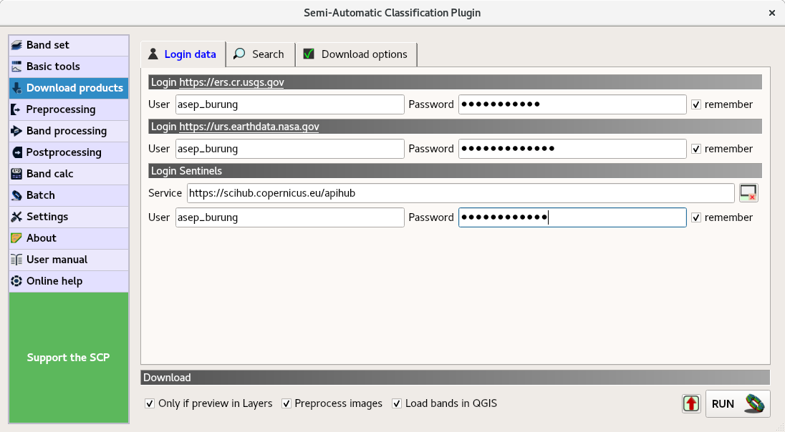

# (PART) Analisis Tutupan Lahan {-}


# Akuisisi data


Pada bagian ini, ada beberapa hal yang perlu dipersiapkan :

- Siapkan koneksi internet yang stabil dan cepat.

- Siapkan ruang hard disk yang cukup.

- Pastikan Openlayers Plugin telah diinstal dan diaktifkan. 

- Pastikan Semi Automatic Classification Plugin (SCP Plugin) telah diinstal dan diaktifkan.

- Kalau Anda suka minum kopi, siapkan secangkir kopi panas, kali ini proses akan cukup memakan waktu lama.


SCP Plugin memudahkan kita untuk melakukan pencarian dan pemrosesan data Landsat. Berikut ini adalah tahapannya :

1. Tampilkan layer OpenStreetMap dengan mengklik __Web -> Openlayers Plugin -> OpenStreetMap -> OpenStreetMap__


```{r data001, fig.cap='Mengaktifkan plugin OpenStreetMap',echo=FALSE, message=FALSE, warning=FALSE, out.width='60%', fig.asp=.75, fig.align='center'}
knitr::include_graphics("img/data001.png")
```


2. Zoom-in ke Kota Bandung dan simpan proyek dengan mengklik __Project -> Save__.

```{r data002, fig.cap='Basemap OpenStreetMap telah aktif',echo=FALSE, message=FALSE, warning=FALSE, out.width='60%', fig.asp=.75, fig.align='center'}
knitr::include_graphics("img/data002.png")
```


3. Buka menu __Download products__ dengan memilih __SCP__ | __Download products__

```{r data003, fig.cap='Download products',echo=FALSE, message=FALSE, warning=FALSE, out.width='30%', fig.asp=.75, fig.align='center'}
knitr::include_graphics("img/data003.png")
```


4. Pada tab __Login data__ isikan User dan Password untuk ketiga penyedia layanan (EROS, Earthdata dan Sentinel) 

```{r data004, fig.cap='Isian Login data untuk mengunduh Landsat 5',echo=FALSE, message=FALSE, warning=FALSE, out.width='70%', fig.asp=.75, fig.align='center'}

```


5. Pilih Tab __Search__


```{r data005a, fig.cap='Isian di Tab Search',echo=FALSE, message=FALSE, warning=FALSE, out.width='70%', fig.asp=.75, fig.align='center'}
knitr::include_graphics("img/data005a.png")
```


- Set area dengan mengklik tanda plus (+). Aktifkan Map View, klik kiri di bagian pojok kiri atas (UL - Upper Left), klik kanan di bagian pojok kanan bawah (LR - Lower Right). Apabila sukses, maka kolom isian UL dan LR akan terisi secara otomatis.


```{r data006, fig.cap='Set area',echo=FALSE, message=FALSE, warning=FALSE, out.width='70%', fig.asp=.75, fig.align='center'}
knitr::include_graphics("img/data006.png")
```


- Pilih __L4-5 TM__ untuk __Products__

- Pilih tanggal ( __Date from__ ) untuk rentang waktu 1990-06-01 sampai dengan 1990-07-31

- Pilih maksimum tutupan awan ( __Max. cloud cover__ ) 10%

- Klik ikon __Find__ untuk melakukan pencarian.

- Hasilnya akan muncul dalam __Product List__. 

- Pilih hasil nomor 4 dan klik ikon __Preview__, pastikan bahwa Kota Bandung tidak tertutup awan.

- Hapus hasil pencarian yang lain (Nomor 1,2,3 dan 5) dengan mengklik ikon Hapus (-)

- Untuk opsi di bagian bawah, __Only if preview in Layers__, Anda dapat hapuskan tanda centang. Centang pula __Preprocess Images__, untuk mempermudah pra-pengolahan citra. Saya akan jelaskan lebih lanjut mengenai apa yang dilakukan pada tahapan ini dalam subbagian tersendiri.

- Apabila Anda ingin melakukan pencarian ulang, klik ikon Hapus Semua.


6. Abaikan Tab __Download option__, kita akan mengunduh semua layer (channel/band).

7. Klik ikon __Run__ dan pilih folder untuk menyimpan hasilnya. 

Tunggu proses sampai selesai. Nah, saat ini adalah waktu yang tepat untuk menyeruput kopi. Bahkan, apabila internet sedang lemot, Anda dapat melakukan pekerjaan bermanfaat lain seperti mencuci piring. Ingat, jangan terlalu banyak rebahan ya :D

```{r data007, fig.cap='Proses download citra',echo=FALSE, message=FALSE, warning=FALSE, out.width='70%', fig.asp=.75, fig.align='center'}
knitr::include_graphics("img/data007.png")
```


