# Prinsip dasar penginderaan jauh

OK, di bagian ini saya akan mengkombinasikan antara praktek dan teori. Seperti pesan yang masih saya ingat betul dari Prof. Hasan Z. Abidin, _"There is nothing as practical as a good theory"_. Catatan: pesan ini aslinya dipopulerkan oleh Lewin (1943, 1944, 1945), namun menurut saya masih berlaku hingga saat ini.

Kembali ke data yang telah diunduh menggunakan SCP Plugin di QGIS. Proses yang dijalankan dengan SCP Plugin membuat dua untuk menyimpan data Landsat, (1) LT05_L1TP_122065_19900709_20170129_01_T1_1990-07-09, (2) LT05_L1TP_122065_19900709_20170129_01_T1_1990-07-09_converted. 

```{r figc4001, fig.cap='Struktur folder',echo=FALSE, message=FALSE, warning=FALSE, out.width='50%', fig.asp=.75, fig.align='center'}
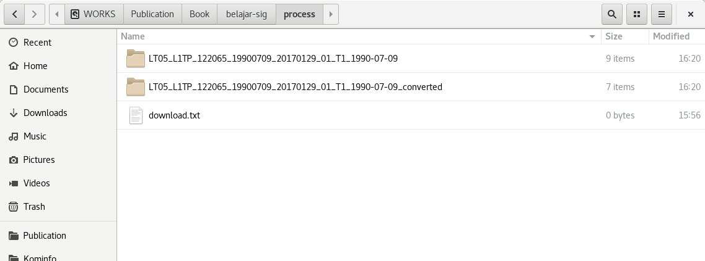
```


Folder pertama menyimpan data yang direkam oleh citra ( _raw data_ ),sedangkan folder kedua berisi berkas (file) yang sudah dilakukan prapengolahan (_Masih ingat kan tadi kita memilih __Pre-process images__ ?_)

Kedua folder memiliki 8 berkas TIF dan 1 berkas teks (untuk folder pertama). Kedelapan berkas TIF terdiri dari hasil perekaman dari tujuh (7) _band_ dan satu (1) file Quality Assurance (QA). Satu berkas teks (\_MTL.txt) adalah berkas metadata. 


```{r figc4002, fig.cap='Raw data citra Landsat 5',echo=FALSE, message=FALSE, warning=FALSE, out.width='70%', fig.asp=.75, fig.align='center'}
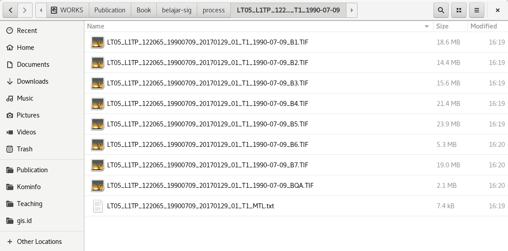
```


```{r figc4003, fig.cap='File citra Landsat 5 yang sudah dilakukan pre-processing',echo=FALSE, message=FALSE, warning=FALSE, out.width='70%', fig.asp=.75, fig.align='center'}
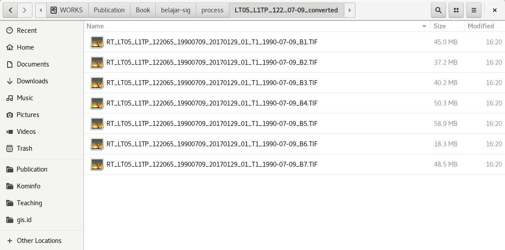
```

Penamaan berkas untuk setiap _band_ mengikuti pola tertentu. Sebagai contoh, band 1 memiliki nama berkas LT05_L1TP_122065_19900709_20170129_01_T1_1990-07-09_B1.TIF, yang dapat dijelaskan sebagai berikut :

```
- LT05 : Menunjukkan berkas tersebut adalah berkas data Landsat 5

- L1TP : Level pengolahan, Tier 1 Level 1 Precision and Terrain.  
Tier 1 memiliki kualitas data yang paling tinggi dan cocok digunakan untuk analisis 
time series. Data telah dikalibrasi untuk ragam instrumen 
Landsat dan memiliki tolerasi kesalahan geometrik (RMSE) <= 12 meter.

- 122065 : Nomor Path : 122 dan nomor Row : 065

- 1990709 : Tanggal perekaman

- 20170129 : Tanggal ingestion

- 1990-07-09 : Tanggal perekaman

- B1 : Band 1
```

__Path-Row__ merupakan istilah yang digunakan oleh satelit Landsat untuk akuisisi citra berbasis Worldwide Reference System (WRS). __Path__ mengacu pada salah satu dari 251 trek timur-barat yang dibuat oleh satelit saat mengikuti orbitnya, yang berada 440 hingga 570 mil ke arah Utara dan cenderung ke garis khatulistiwa. __Row__ mengacu pada _side-to-side scan_ di sepanjang jalur orbit, dengan nomor __Row__ mengacu pada garis tengah garis lintang setiap frame. Ada 119 row,  dari 80 derajat Lintang Selatan ke 80 derajat Lintang Utara. __Scene__ adalah serangkaian row lengkap, yang mencakup 24 detik waktu perjalanan satelit, sehingga dalam orbit lengkap, 248 __scene__ diperoleh selama 6196 detik (1,72 jam) untuk Landsat 1. Gambar berikut merupakan contoh cakupan Scene Landsat 8 di Indonesia. Bagian yang diberi tanda kotak merah adalah Path-Row 122-065.

```{r figc4004, fig.cap='Path-row Landsat di Indonesia',echo=FALSE, message=FALSE, warning=FALSE, out.width='70%', fig.asp=.75, fig.align='center'}
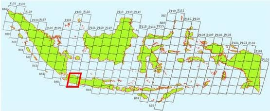
```


Berkas _MTL.txt berisi metadata dari scene Landsat yang diunduh. Isi dari metadata Landsat termasuk waktu perekaman, posisi satelit, konstanta dan lainnya yang diperlukan untuk melakukan koreksi radiometrik. Apabila kita melakukan koreksi radiometrik secara manual, maka kita harus membaca metadata dan menggunakan informasi di dalamnya. Untuk tahapan yang kita lakukan, berkas metadata digunakan oleh SCP Plugin untuk proses koreksi radiometrik.

Adapun untuk folder converted, pola nama berkasnya hampir sama dengan di atas, perbedaannya terletak pada awalan (RT), yang menunjukkan bahwa data sudah dalam format _reflectance_. Apa itu _reflectance_? _Sabar kawan, nanti kita akan belajar tentang itu_.

Supaya otak kita tidak terlalu panas, saya cukupkan dahulu penjelasan mengenai struktur data Landsat. Sekarang kita akan melihat dan bermain-main dengan data citra Landsat yang telah kita unduh. 

_"Are you ready? Let's get it on!"_


## Spectral signature

___Spectral signature___ adalah prinsip #1 dalam memahami konsep inderaja. __Spektral signature__ menampilkan semua variasi reflektansi radiasi spektrum gelombang sebagai fungsi dari panjang gelombang. Gambar di bawah memperlihatkan __spectral signature__ untuk vegetasi. 

```{r figc4005, fig.cap='Pola spektral air dan vegetasi',echo=FALSE, message=FALSE, warning=FALSE, out.width='70%', fig.asp=.75, fig.align='center'}
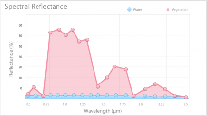
```


Istilah __spectral signature__ memberikan makna bahwa obyek-obyek di permukaan bumi memiliki karakteristik tersendiri dalam memantulkan gelombang elektromagnetik. Seperti terlihat pada gambar berikut air, rumput kering, vegetasi dan salju memiliki karakteristik yang berbeda.

```{r figc4006, fig.cap='Pola spektral air, rumput kering, vegetasi dan salju',echo=FALSE, message=FALSE, warning=FALSE, out.width='70%', fig.asp=.75, fig.align='center'}
knitr::include_graphics("img/spectral-signatures-2.png")
```


Dengan data yang sudah diunduh dan bermodalkan QGIS, kita akan belajar lebih lanjut tentang prinsip ini.

Gunakan panel __Browser__ di QGIS, buka folder data. Sebagai contoh, folder data saya ada di /home/firmanhadi/00_qgis. 


```{r qgis001, fig.cap='Browser Panel',echo=FALSE, message=FALSE, warning=FALSE, out.width='70%', fig.asp=.75, fig.align='center'}
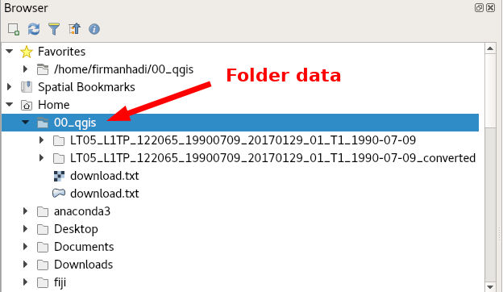
```


Di __Panel Layers__, klik __Add Group__ untuk membuat grup layer yang baru, ubah namanya menjadi _rawdata_ dengan klik kanan dan pilih __Rename Group__.

```{r qgis002, fig.cap='Add group',echo=FALSE, message=FALSE, warning=FALSE, out.width='50%', fig.asp=.75, fig.align='center'}
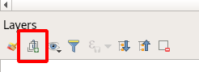
```


Pastikan grup _rawdata_ tersorot dan pilih tujuh (7) band rawa data yang ada di dalam folder LT05_L1TP_122065_19900709_20170129_01_T1_1990-07-09. Setelah terpilih, klik kanan dan pilih __Add selected layers to project__.

```{r qgis003, fig.cap='Menampilkan file di Main Display',echo=FALSE, message=FALSE, warning=FALSE, out.width='50%', fig.asp=.75, fig.align='center'}
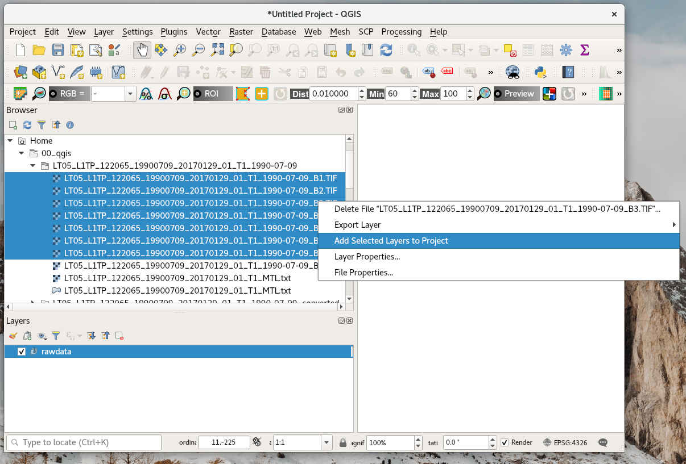
```


Band 7 secara otomatis akan terpilih di __Panel Layers__ dan ditampilkan di __Map Display__


Tahapan yang seringkali dilupakan setelah membuka data citra adalah memahami informasi terkait data (metadata). Di QGIS, untuk mengetahui metadata citra, kita dapat klik dua kali nama band di __Panel Layers__. Kita dapat membaca metadata seperti Name, Path, CRS, Extent dan lainnya di tab __Information__. Berhubung sub bagian ini adalah tentang __Spectral Signature__, penjelasan tentang isi dari metadata akan ditulis di sub bagian yang lain.


```{r qgis004, fig.cap='Menampilkan metadata',echo=FALSE, message=FALSE, warning=FALSE, out.width='50%', fig.asp=.75, fig.align='center'}
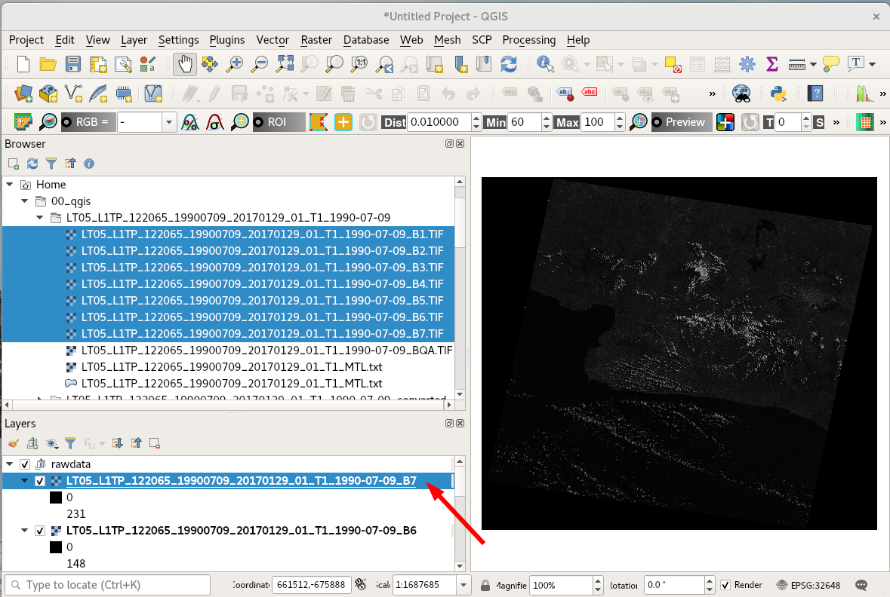
```


```{r qgis005, fig.cap='Metadata file citra',echo=FALSE, message=FALSE, warning=FALSE, out.width='50%', fig.asp=.75, fig.align='center'}
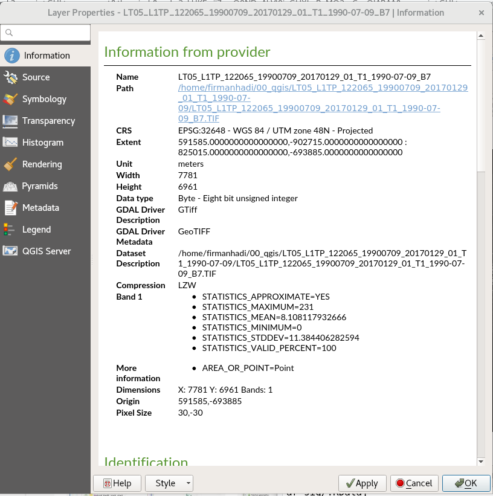
```


Selanjutnya, tambahkan Layer OpenStreetMap dengan memilih menu __Web -> OpenLayers Plugin -> OpenStreetMap -> OpenStreetMap__. Fokuskan di wilayah Kota Bandung seperti terlihat pada gambar. 


```{r qgis006, fig.cap='OpenStreetMap sebagai basemap',echo=FALSE, message=FALSE, warning=FALSE, out.width='50%', fig.asp=.75, fig.align='center'}
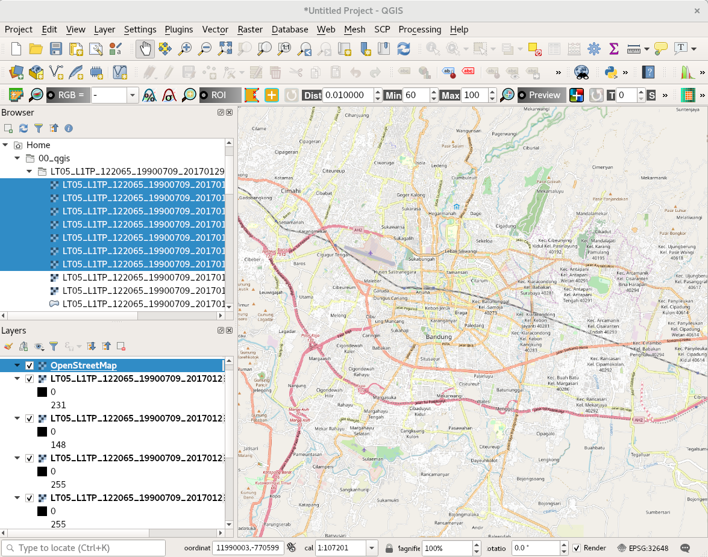
```


Selanjutnya sembunyikan layer OpenStreetMap sehingga yang ditampilkan di Map Display adalah Band 7. 


```{r qgis007, fig.cap='Menon-aktifkan basemap',echo=FALSE, message=FALSE, warning=FALSE, out.width='50%', fig.asp=.75, fig.align='center'}
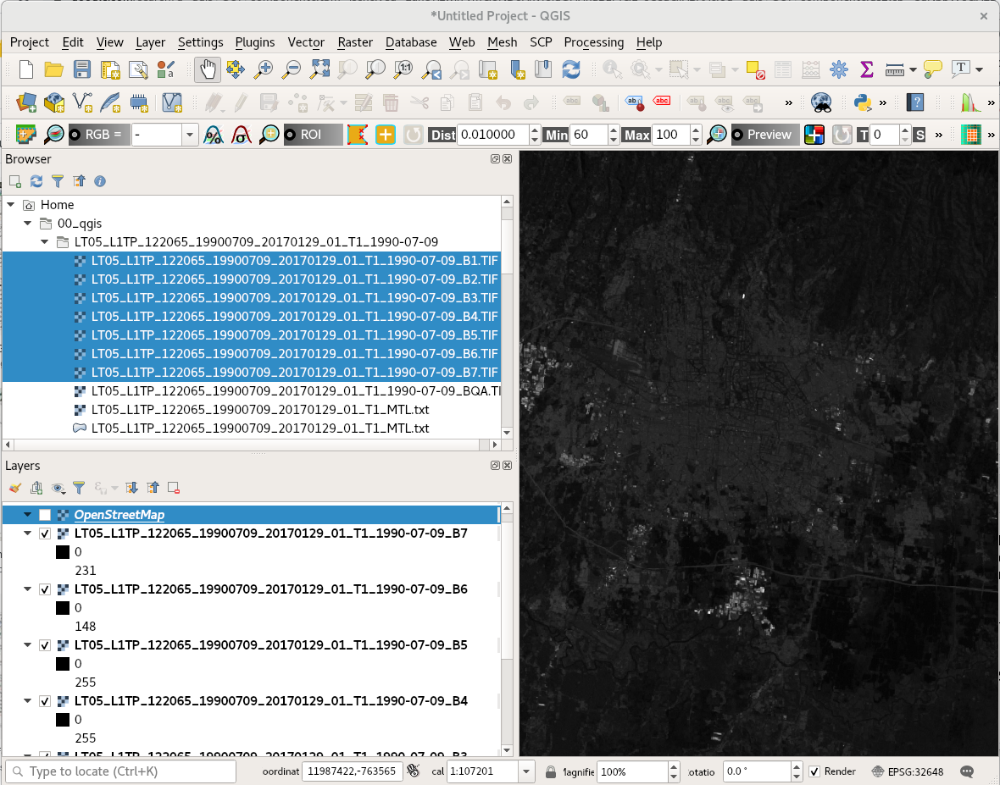
```

Nama _band_ di __Panel Layers__ bagi saya terlalu panjang, makan tempat, _ya tidak_? Untuk mengemat ruang tampilan, kita dapat mengubah namanya menjadi lebih singkat seperti Band 7 atau B7. Caranya? Klik kanan pada nama band dan pilih __Rename Layer__. Setelah proses pengubahan nama, kita akan mendapatkan tampilan dengan porsi __Map Display__ yang lebih luas.


```{r qgis008, fig.cap='Menampilkan Band 7',echo=FALSE, message=FALSE, warning=FALSE, out.width='50%', fig.asp=.75, fig.align='center'}
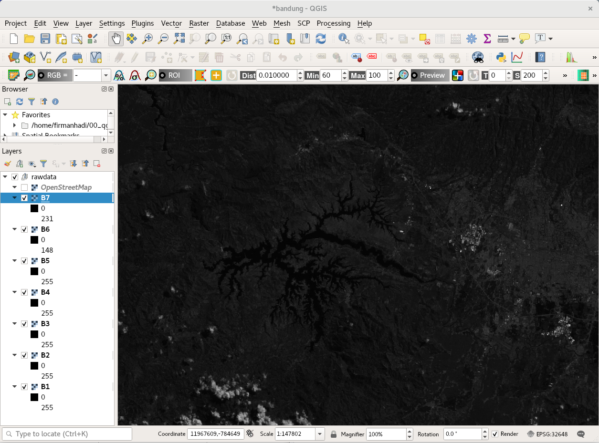
```


Apa yang dapat Anda lihat dari Band 7? Gelap? Bandingkan dengan gambar selanjutnya, terlihat lebih jelas bukan?

```{r qgis012, fig.cap='Menampilkan Band 7 dengan tampilan lebih jelas',echo=FALSE, message=FALSE, warning=FALSE, out.width='50%', fig.asp=.75, fig.align='center'}
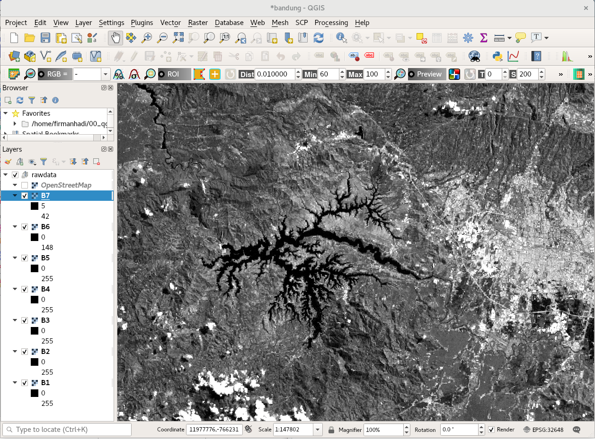
```


Untuk membuat visualisasi citra lebih jelas, yang perlu dilakukan adalah mengaktifkan __Raster Toolbar__, klik menu __View -> Toolbars -> Raster Toolbar__. 

```{r qgis013, fig.cap='Mengaktiffkan Raster Toolbal',echo=FALSE, message=FALSE, warning=FALSE, out.width='50%', fig.asp=.75, fig.align='center'}
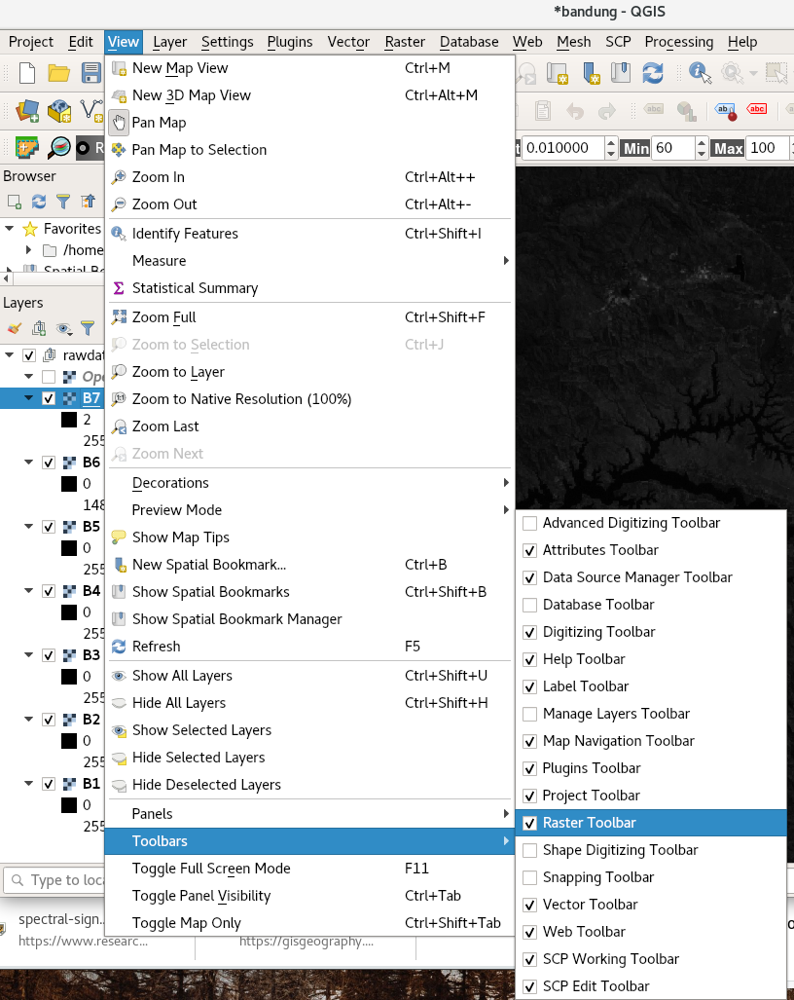
```


Untuk membuat citra menjadi lebih jelas, klik ikon seperti pada gambar. Ikon ini akan melakukan perentangan nilai sehingga citra menjadi lebih kontras.

```{r qgis014, fig.cap='Merentangkan nilai Band 7 sesuai display',echo=FALSE, message=FALSE, warning=FALSE, out.width='50%', fig.asp=.75, fig.align='center'}
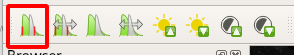
```


Mengapa citra satelit yang diunduh nampak gelap? Untuk menjawab pertanyaan ini, kita dapat melihat histogram Band 7. Klik dua kali pada nama _band_, pilih __Histogram__. 

```{r qgis015, fig.cap='Menampilkan histogram',echo=FALSE, message=FALSE, warning=FALSE, out.width='50%', fig.asp=.75, fig.align='center'}
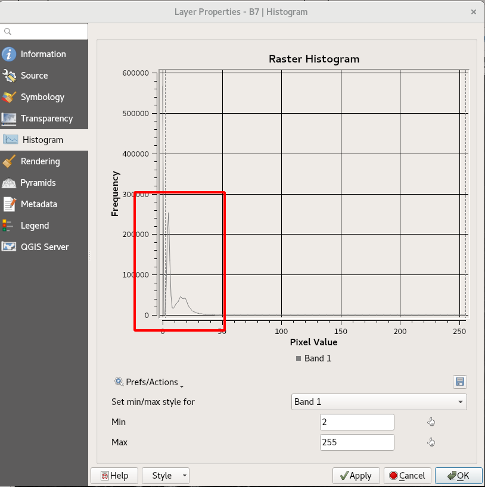
```


Histogram memperlihatkan nilai digital dari Band 7 lebih banyak berada di sebelah kiri histogram, di bawah nilai 50. Apa dampaknya? Citra akan terlihat gelap. Sebaliknya, apabila data lebih banyak berada di sebelah kanan histogram, maka citra akan terlihat terang. Citra dengan visualisasi yang kontras dan jelas itu akan dapat dicapai apabila datanya terdistribusi normal. Cara yang telah kita praktekkan itu pada dasarnya meregangkan nilai sehingga data terdistribusi normal, secara visual. 

Setiap band Landsat disimpan dalam berkas terpisah dalam format TIFFF. Untuk melihat profil reflektansi dari data yang kita miliki, _band_ yang ada harus digabungkan menjadi satu berkas dengan fungsi __Merge__ di QGIS. 

Cara melakukan penggabungan _band_ di QGIS adalah sebagai berikut :

1. Klik __Raster -> Miscellaneous -> Merge__.


```{r qgis016, fig.cap='Menggabungkan file (merge)',echo=FALSE, message=FALSE, warning=FALSE, out.width='60%', fig.asp=.75, fig.align='center'}
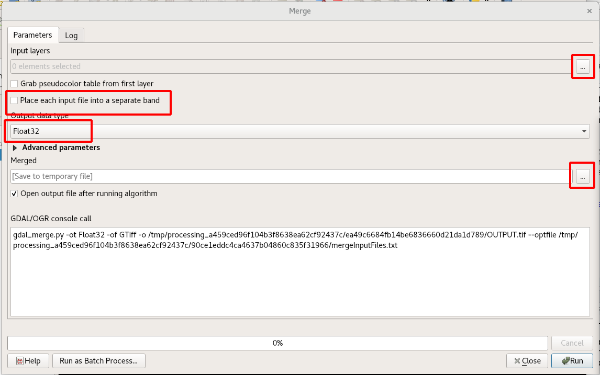
```


2. Klik tiga titik di bagian kanan __Input Layers__. Pilih B1, B2, B3, B4, B5 dan B7.  Pastikan urutan band mulai dari B1 hingga ke B7, bukan sebaliknya. 

```{r qgis017, fig.cap='Mengurutkan band yang akan digabungkan',echo=FALSE, message=FALSE, warning=FALSE, out.width='50%', fig.asp=.75, fig.align='center'}
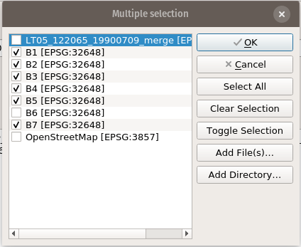
```


Tips untuk mendapatkan posisi seperti ini adalah dengan menampilkan setiap layer di Map Display dengan B1 di urutan bagian bawah, dan B7 di bagian paling atas.

```{r qgis019, fig.cap='Mengurutkan band di Layers Panel',echo=FALSE, message=FALSE, warning=FALSE, out.width='50%', fig.asp=.75, fig.align='center'}
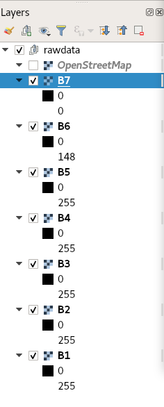
```


3. Centang bagian __Place each input file into a separate band__

4. Pilih Byte untuk __Output data type__

5. Pilih berkas untuk menyimpan hasil.

6. Pastikan pilihan yang ada sudah diisi sebelum mengklik __Run__.

```{r qgis018, fig.cap='Proses merging',echo=FALSE, message=FALSE, warning=FALSE, out.width='50%', fig.asp=.75, fig.align='center'}
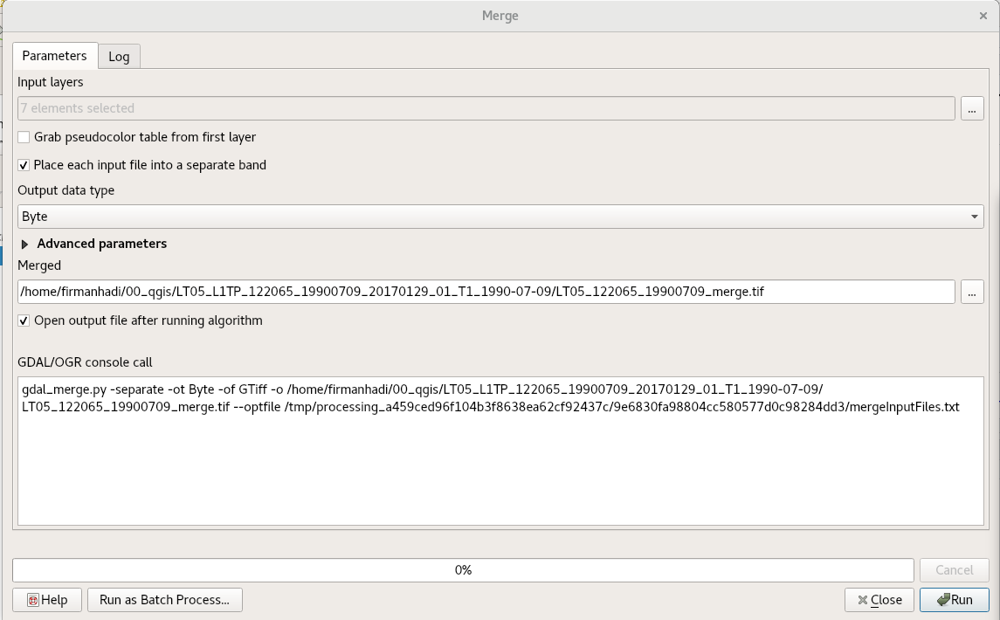
```


7. Apabila tidak ada pesan kesalahan, berarti file gabungan telah berhasil dibuat.


```{r qgis020, fig.cap='Proses merging telah selesai',echo=FALSE, message=FALSE, warning=FALSE, out.width='70%', fig.asp=.75, fig.align='center'}
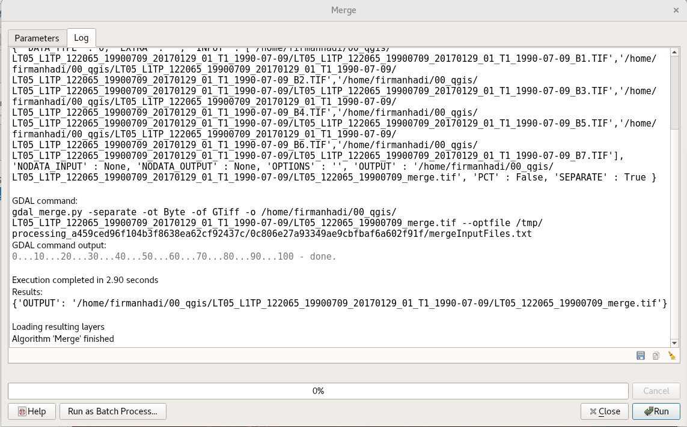
```
```{r qgis021, fig.cap='Citra hasil merging',echo=FALSE, message=FALSE, warning=FALSE, out.width='70%', fig.asp=.75, fig.align='center'}
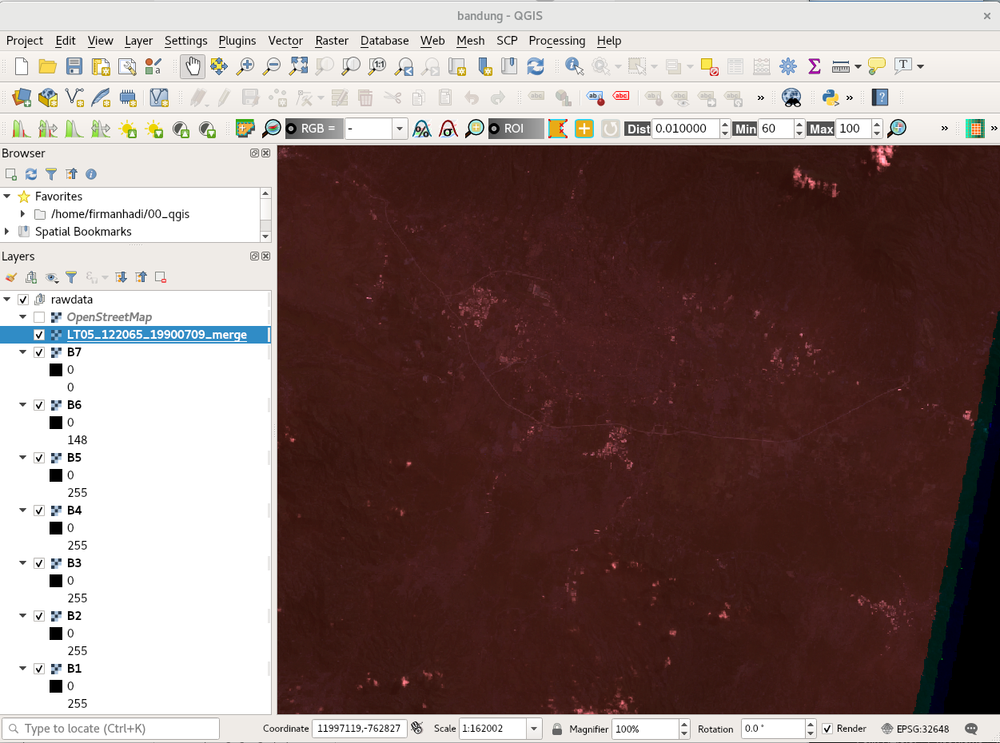
```


Proses _merging_ sudah selesai. Citranya kali ini terdiri dari banyak _band_. Tapi kok masih terlihat gelap? Apakah kita dapat melakukan cara yang sama untuk memperjelas citra seperti sebelumnya? 

Jawabannya adalah bisa, tapi hasilnya tidak memperlihatkan warna yang sebenarnya. 

```{r qgis022, fig.cap='Visualisasi citra hasil merging',echo=FALSE, message=FALSE, warning=FALSE, out.width='70%', fig.asp=.75, fig.align='center'}
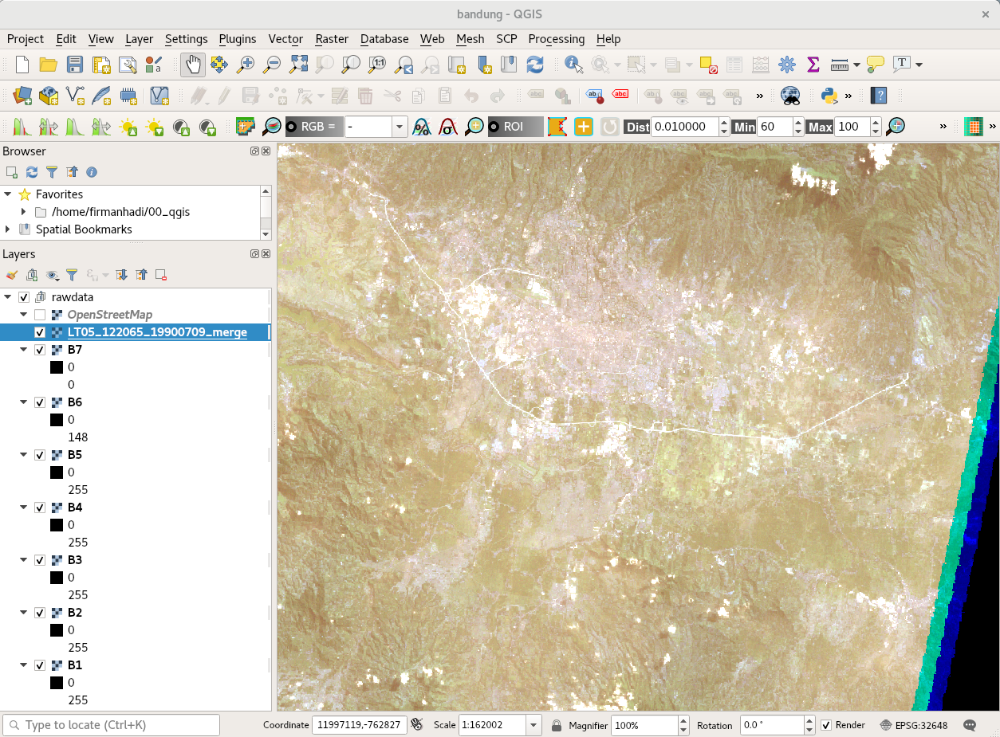
```


Hal ini terjadi karena kita belum mengatur susunan band dalam format RGB, seperti berikut :

1. Klik dua kali file hasil merge.

2. Klik Symbology

3. Pilih Band 3 untuk __Red band__, Band 2 untuk __Green band__, Band 1 untuk __Blue band__. 

4. Pilih __Stretch to MinMax__ untuk __Contrast Enhancement__.

5. Klik __OK__.

```{r qgis023, fig.cap='Simbologi citra',echo=FALSE, message=FALSE, warning=FALSE, out.width='70%', fig.asp=.75, fig.align='center'}
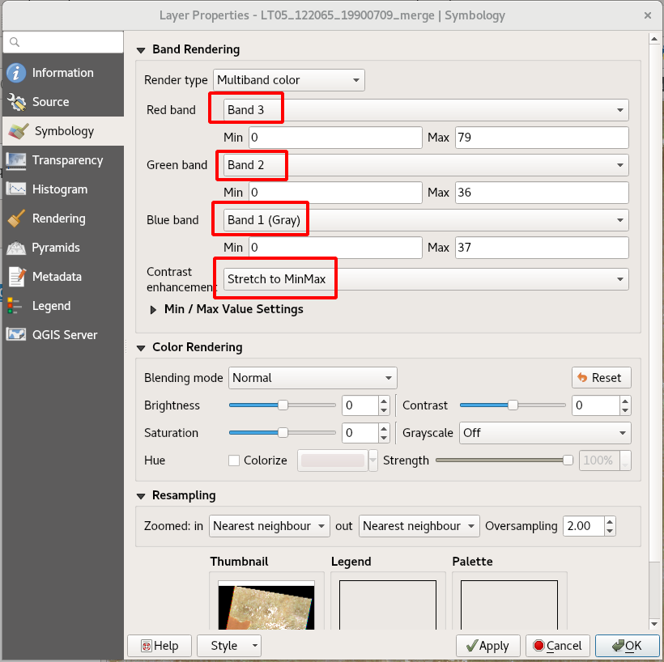
```


```{r qgis024, fig.cap='Visualisasi citra RGB True Color',echo=FALSE, message=FALSE, warning=FALSE, out.width='70%', fig.asp=.75, fig.align='center'}
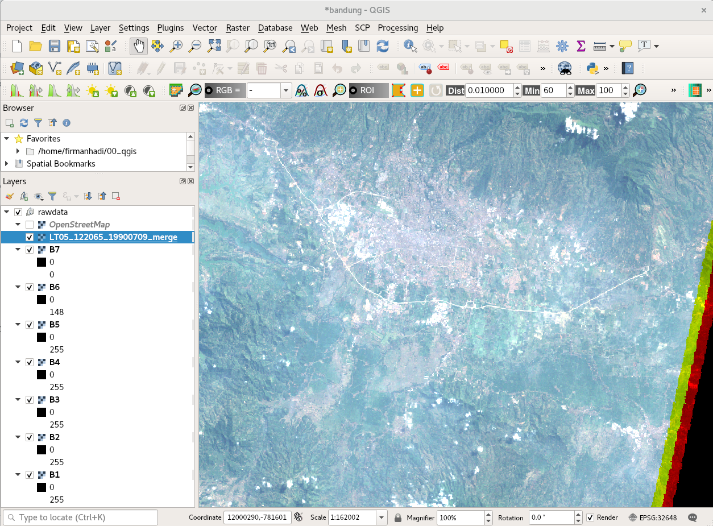
```


Selanjutnya, aktifkan plugin __Temporal/Spectral Profile Tool__ dengan memilih menu __Spectral 
Plugins -> Profile Tool -> Temporal/Spectral Profile__ . Untuk mengetahui profil spektral obyek, klik pada obyek yang diinginkan pada Map Display. Sebagai contoh, tiga gambar berikut memperlihatkan perbedaan _spectral signature_ untuk obyek air, vegetasi dan urban (built up).

```{r qgis026, fig.cap='Pola spektral air',echo=FALSE, message=FALSE, warning=FALSE, out.width='70%', fig.asp=.75, fig.align='center'}
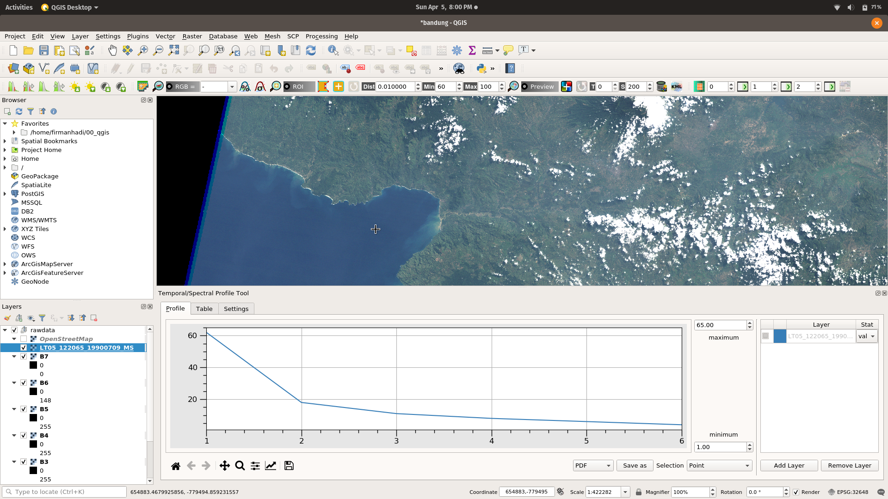
```


```{r qgis027, fig.cap='Pola spektral vegetasi',echo=FALSE, message=FALSE, warning=FALSE, out.width='70%', fig.asp=.75, fig.align='center'}
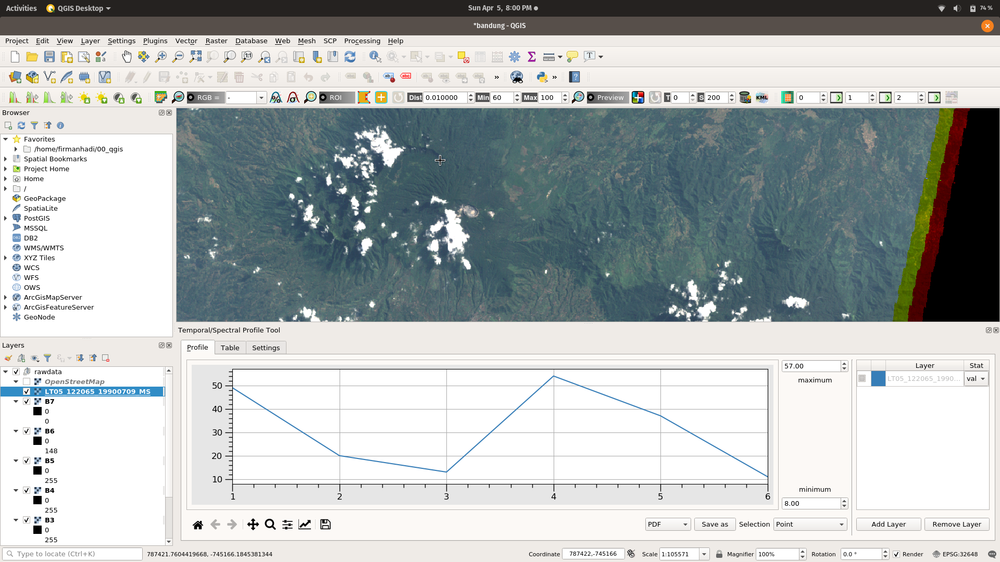
```

```{r qgis028, fig.cap='Pola spektral urban',echo=FALSE, message=FALSE, warning=FALSE, out.width='70%', fig.asp=.75, fig.align='center'}
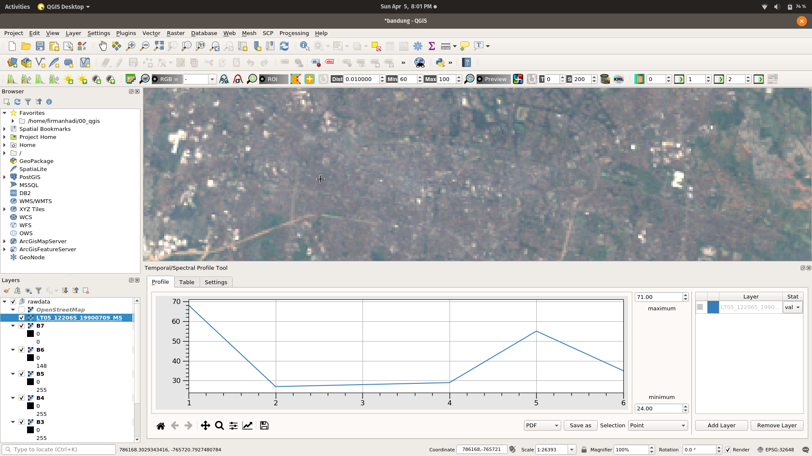
```


Gambar berikut memperlihatkan perbandingan karakteristik _spectral signature_ air, vegetasi dan urban dari tiga titik sampel sebelumnya. Pola _spectral signature_ untuk air memperlihatkan bahwa semakin panjang panjang gelombang. Hmmm, bahasanya rancu ya? Dalam bahasa Inggris, _the longer the wavelength, the lower the reflectance value_. Untuk vegetasi, terlihat ada lonjakan dari Band 3 ke Band 4, sedangkan untuk urban, tidak ada lonjakan nilai reflektansi untuk kedua obyek ini. 
Dari perbedaan pola grafik ketiga obyek, kita dapat menyimpulkan bahwa air, vegetasi dan urban memiliki _spectral signature_ yang berbeda. Artinya, secara teoritis, data yang ada dapat digunakan untuk membuat peta dengan kelas tataguna lahan air, vegetasi dan urban. Lebih jelasnya akan dibahas pada sub bagian klasifikasi.


```{r qgis039, fig.cap='Pola spektral air, vegetasi dan urban',echo=FALSE, message=FALSE, warning=FALSE, out.width='70%', fig.asp=.75, fig.align='center'}
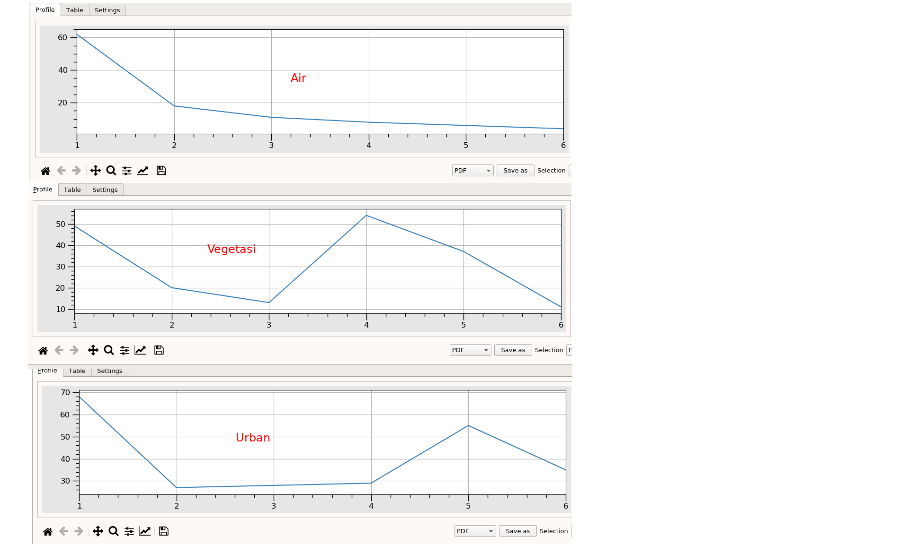
```


## Semua adalah angka

Prinsip #2 inderaja yang perlu dipahami adalah __semua adalah angka__. Reflektansi adalah satuan yang digunakan untuk menampilkan rasio jumlah spektrum elektro magnetik (EM) yang dipantulkan oleh obyek terhadap jumlah spektrum EM yang mengenainya. Peristiwa pemantulan gelombang yang merupakan sebuah peristiwa fisika (analog). Mata kita dapat mengindera pantulan cahaya dari obyek dan otak menginterpretasikannya sesuai intensitas. 

Sistem inderaja merekam intensitas pantulan cahaya dengan melakukan transformasi intensitas pantulan setiap spektrum EM ke dalam bentuk angka. Apa yang kita lihat warna putih, abu-abu atau hitam dalam citra satelit, pada dasarnya adalah angka.

Sebagai contoh, gambar berikut memperlihatkan angka 0 direpresentasikan dengan warna hitam, angka 255 dalam warna putih dan warna lain dengan tingkat keabuan yang berbeda, ditampilkan dengan angka antara 0 hingga 255.

```{r qgis041a, fig.cap='Visualisasi angka digital dalam citra',echo=FALSE, message=FALSE, warning=FALSE, out.width='70%', fig.asp=.75, fig.align='center'}
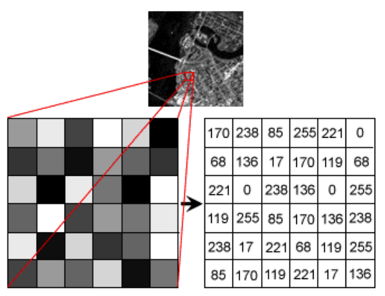
```


Angka 0 hingga 255 adalah angka yang disimpan dalam komputer dengan tipe data 8 bit. Tipe data ini mampu menyimpan $2^8 = 256$ nilai. Nilai minimum dan maksimum dari tipe data 8 bit, mungkin antara -128 hingga 127 apabila tipenya _signed integer_, atau antara 0 hingga 255 apabila tipenya _unsigned integer_.

Jadi, angka digital dalam inderaja merepresentasikan nilai reflektansi. Dalam tipe data 8 bit, nilai reflektansi 0 disimpan dalam 0, ditampilkan dalam warna hitam. Nilai reflektansi 100 disimpan dalam angka 255, ditampilkan dalam warna hitam.

```{r fig041, fig.cap='Angka Digital',echo=FALSE, message=FALSE, warning=FALSE, out.width='70%', fig.asp=.75, fig.align='center'}
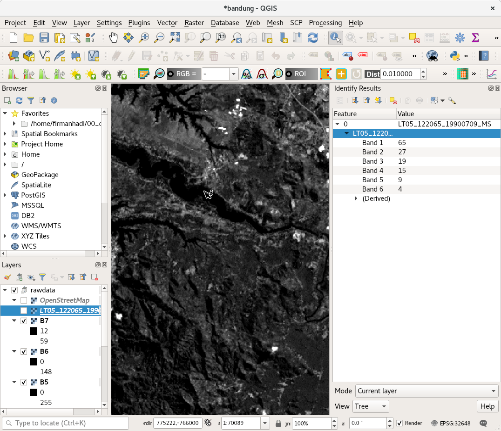
```


Gambar di atas memperlihatkan nilai digital obyek air untuk B1, B2, B3, B4, B5 dan B6, dengan catatan B6 adalah Band 7 dari Landsat 5 TM. B1-B5 dan B7 dari Landsat 5 TM disebut dengan _multi-spectral channel_. 

Penyimpanan informasi reflektansi dalam bentuk nilai digital, memungkinkan mata kita untuk 'membaca' perilaku obyek dalam memantulkan spektrum EM di luar spektrum tampak. 


<!-- dilakukannya analisis kuantitatif seperti _ratioing_, _change detection_, klasifikasi dan lainnya. -->


## Visualisasi RGB

Citra satelit memanfaatkan ragam spektrum EM yang memungkinkan kita untuk mendeteksi dan melakukan klasifikasi obyek-obyek itu berdasarkan Prinsip #1 (_spectral signature_). Ragam spektrum yang digunakan berada dalam rentang spektrum dengan panjang gelombang antara $10^(-12)$ untuk sinar gamma hingga 1 kilometer untuk gelombang radio.

```{r fig401, fig.cap='Spektrum Gelombang Elektromagnetik',echo=FALSE, message=FALSE, warning=FALSE, out.width='70%', fig.asp=.75, fig.align='center'}
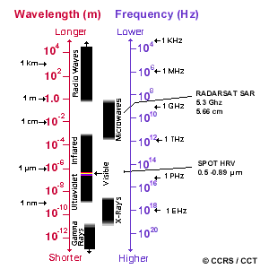
```

Pengindraaan jauh memanfaatkan spektrum EM mulai dari gelombang tampak (visible) hingga gelombang mikro. Sehingga, sensor mampu mendeteksi spektrum yang jauh lebih lebar dibandingkan mata manusia yang hanya dalam rentang 0,4 - 0,7 $\mu$m saja. 

```{r fig402, fig.cap='Spektrum gelombang tampak',echo=FALSE, message=FALSE, warning=FALSE, out.width='70%', fig.asp=.75, fig.align='center'}
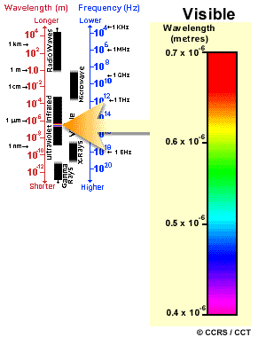
```

Prinsip #3 Visualisasi RGB memungkinkan mata manusia melihat apa yang ditangkap oleh sensor indraja dalam rentang spektrum tidak tampak. Caranya adalah menggabungkan nilai digital dari tiga band (channel) dengan konsep warna RGB, seperti pada Gambar \@ref(fig:fig403).

```{r fig403, fig.cap='Visualisasi RGB',echo=FALSE, message=FALSE, warning=FALSE, out.width='70%', fig.asp=.75, fig.align='center'}
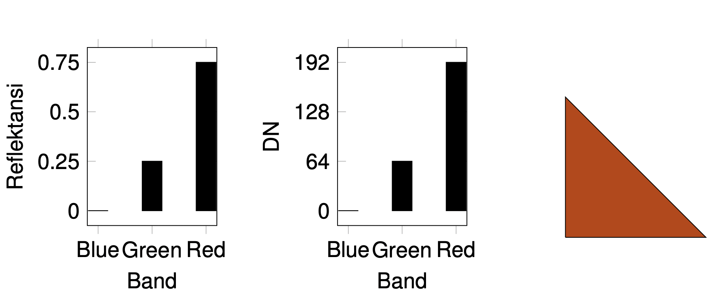
```

Dengan konsep tersebut, apabila Band 3 (Red) ditempatkan sebagai komponen R, Band 2 (Green) sebagai G dan Band 1 (Blue) sebagai komponen B, maka komposit warna yang terlihat akan sama dengan mata kita. Ini disebut dengan ___True Color Composite___.

```{r fig404, fig.cap='True Color Composite',echo=FALSE, message=FALSE, warning=FALSE, out.width='70%', fig.asp=.75, fig.align='center'}
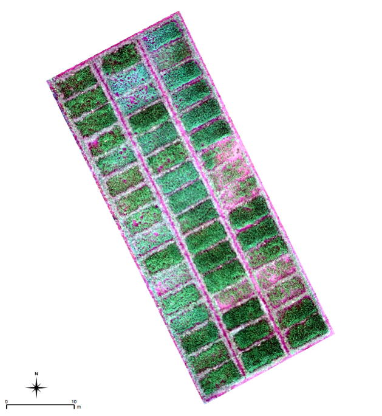
```

Dengan visualisasi RGB, kita mampu memetakan band tidak tampak seperti Near Infra Red dalam komponen RGB. Sebagai contoh, apabiila Band 4 ditempatkan sebagai komponen R, Band 3 sebagai G dan Band 2 sebagai B, maka kita akan melihat obyek yang sama dengan warna palsu ( ___False Color Composite___ ).

```{r fig405, fig.cap='False Color Composite',echo=FALSE, message=FALSE, warning=FALSE, out.width='70%', fig.asp=.75, fig.align='center'}
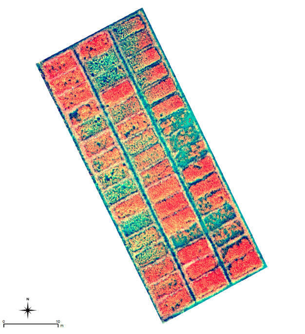
```

Jadi, dari Gambar \@ref(fig:fig404) dan \@ref(fig:fig405), kita dapat melihat perbedaan antara apa yang dilihat oleh mata manusia dan sensor indraja. Mata manusia hanya mampu melihat dengan kombinasi spektrum tampak, dengan warna daun berwarna hijau. Sensor satelit, bukan saja dapat melihat daun dengan sensor tampak, tapi juga dengan sensor tidak tampak seperti NIR. 

## Minimalisasi kesalahan

Prinsip berikutnya dalam penginderaan jauh adalah minimalisasi kesalahan. Satelit inderaja beroperasi dalam orbit yang berjarak ratusan hingga ribuan kilometer dari permukaan bumi. Hal ini menyebabkan bias akibat pengaruh atmosfer dan pergerakan satelit serta rotasi bumi.

Oleh karena itu, dalam penginderaan jauh, kita harus melakukan koreksi kesalahan akibat atmosfer dan kesalahan geometrik.


<!-- ### Koreksi radiometrik -->


<!-- ### Koreksi geometrik -->

## Klasifikasi

Prinsip kelima dari penginderaan jauh adalah klasifikasi. Citra satelit yang dikembangkan sejak tahun 1970-an dalam program LANDSAT, bertujuan untuk merekam sumber daya alam yang ada di permukaan bumi. Dari rekaman citra, kita hendak mengetahui wilayah mana yang termasuk ke dalam hutan, perairan, lahan terbuka dan sebagainya.

Proses pendefinisian citra menjadi kelas-kelas tertentu disebut dengan klasifikasi. Secara umum, klasifikasi dapat dilakukan dengan cara tak-terbimbing ( ___unsupervised___ ) atau dengan cara terbimbing ( ___supervised___ ).


